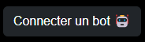

<link rel="stylesheet" type="text/css" href="../css/doc-iframe.css">
<base target="_blank">

<!-- Side navigation -->
<div class="sidebar">
  <h1>Sommaire</h1>
  <ul>
    <li><a target="_self" href="#nombre-de-joueurs-en-jeu">Nombre de joueurs en jeu</a></li>
    <li><a target="_self" href="#carte-de-jeu">Carte de jeu</a></li>
    <li><a target="_self" href="#mode-debug">Mode debug</a></li>
    <li><a target="_self" href="#%C3%A9quipes">Équipes</a></li>
    <li><a target="_self" href="#brokers-et-api-rest">Brokers et API Rest</a></li>
    <li><a target="_self" href="#bots-factices">Bots factices</a>
      <ul>
        <li><a target="_self" href="#ajouter-des-bots">Ajouter des bots</a></li>
        <li><a target="_self" href="#contr%C3%B4ler-un-bot">Contrôler un bot</a></li>
      </ul>
    </li>
    <li><a target="_self" href="#troubleshooting">Troubleshooting</a>
      <ul>
        <li><a target="_self" href="#la-console-web-activemq-est-bloqu%C3%A9e-pour-probl%C3%A8me-de-certificat">La console web ActiveMQ est bloquée pour problème de certificat</a></li>
        <li><a target="_self" href="#erreur-activemq--user-user-is-not-authorized-to-create">Erreur ActiveMQ : User user is not authorized to create...</a></li>
      </ul>
    </li>
  </ul>
</div>

<!-- Page content -->
<div class="main">

# Configuration du serveur


## Nombre de joueurs en jeu

Le définition du nombre de joueurs se fait via le fichier `conf\game.json` et le champs `max_players`.

Actuellement, le nombre maximum de joueurs est également le nombre de joueurs requis pour démarrer la partie.


## Carte de jeu

Le choix de la carte se fait via le fichier `conf\game.json` et le champs `map_id` (nom du fichier map).

Pour être prise en compte, la carte doit être présente dans le dossier `data\maps\`.


## Mode debug

En passant par les scripts de lancement, le mode debug set automatiquement.

Pour l'activer/désactiver manuellement, il faut modifier le fichier `conf\game.json` et passer la valeur de `is_debug` à `true` ou `false.`


## Équipes

Les équipes sont déclarées dans le fichier `conf\teams.json`. L'ID d'une équipe peut être défini dans ce fichier, sinon il sera généré automatiquement au lancement du serveur.

Vous les retrouverez tous dans la console au lancement du serveur, sous cette forme :
```
[INFO] 01/01/2023 12:00:00 - [MAIN] Created teams:
[INFO] 01/01/2023 12:00:00 - Blue team (team-id-1) - COLOR: 0x0042aa, BOTS: 0/1
[INFO] 01/01/2023 12:00:00 - Red team (team-id-2) - COLOR: 0xaa0000, BOTS: 0/1
[INFO] 01/01/2023 12:00:00 - Green team (team-id-3) - COLOR: 0x00bb00, BOTS: 0/1
[INFO] 01/01/2023 12:00:00 - Yellow team (team-id-4) - COLOR: 0xffcc00, BOTS: 0/1
[INFO] 01/01/2023 12:00:00 - Black team (team-id-5) - COLOR: 0x101010, BOTS: 0/1
[INFO] 01/01/2023 12:00:00 - White team (team-id-6) - COLOR: 0xdadada, BOTS: 0/1
```


## Brokers et API Rest

Les informations de connexion aux brokers et le mot de passe admin de l'API Rest (par défaut : `password`) sont disponibles respectivement dans les fichiers :
- `rest.json`
- `mqtt.conf`
- `stomp.conf`


## Bots factices

Des bots sans IA peuvent être ajoutés à votre partie. Ils permettent de remplir le nombre de joueurs requis sans avoir à connecter plusieurs IA.

Le mode debug du serveur est indispensable pour ajouter et contrôler des bots factices.

Ils peuvent également être contrôlés manuellement depuis l'interface Web, ce qui est pratique pour tirer sur sa propre IA et déclencher les messages de dégâts.

### Ajouter des bots

Démarrez le serveur en mode debug et lancez l'interface du jeu ([http://127.0.0.1:8000](http://127.0.0.1:8000)).

Sur la page d'attente de Battlebots, vous remarquerez un bouton `Connecter un bot` en bas à droite. Ce bouton permet d'ajouter un bot sans IA à la partie :

 
 

Il prendra la première équipe disponible sans joueurs.

Si vous n'avez pas ce bouton, c'est que le serveur n'est pas lancé en mode debug.

### Contrôler un bot

Double cliquez sur un bot à l'écran, une télécommande va s'afficher en bas de l'écran pour prendre le contrôle du bot.


## Troubleshooting

### La console web ActiveMQ est bloquée pour problème de certificat

C'est souvent dû à l'utilisation d'un certificat auto signé pour héberger le site. Sous Firefox on peut continuer malgré le message mais pour les navigateurs basés sur Chromium, il faut taper `thisisunsafe` sur votre clavier pour passer à la suite.

### Erreur ActiveMQ : User user is not authorized to create...

Vérifiez vos informations de connexion aux services STOMP et MQTT, il peut s'agir d'une mauvaise notation du nom de file à écouter (inversion entre les `.` utilisés par STOMP et les `/` utilisés par MQTT).

---

</div>
